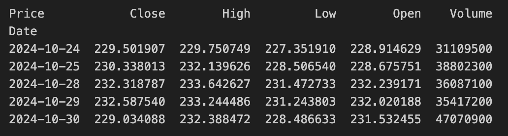
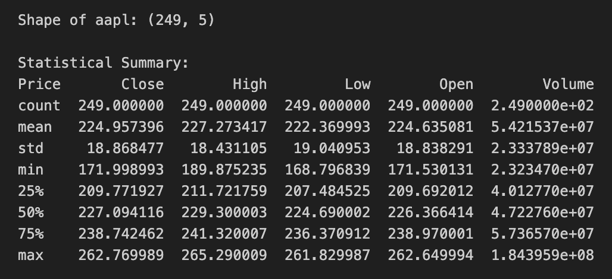
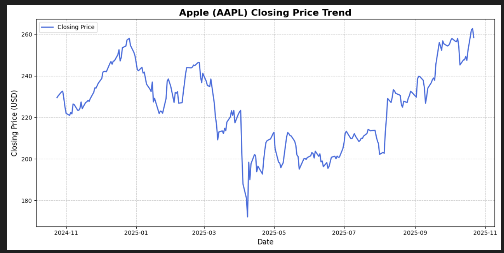
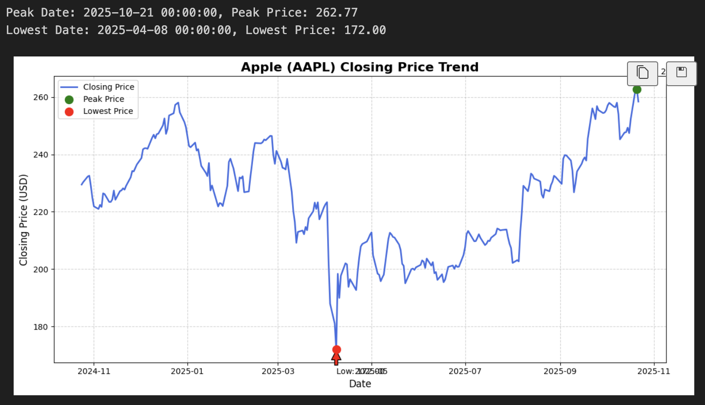
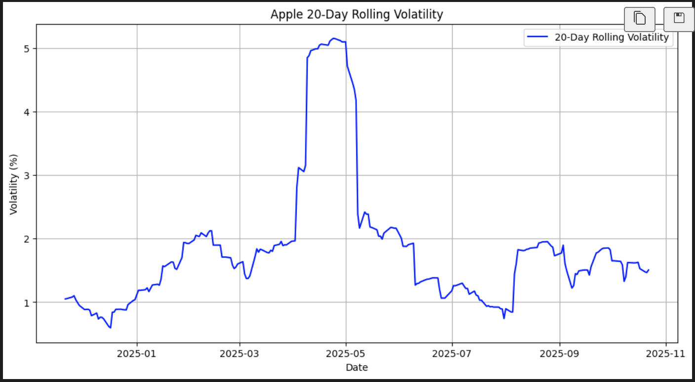
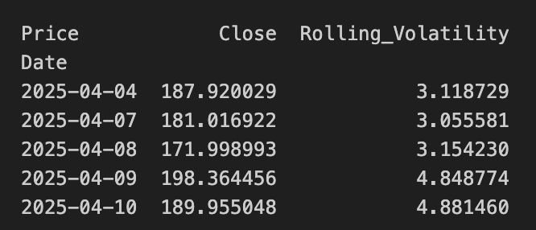

# Analysis Results

## Sample Stock Data

## Statistical Summary

## Closing Price Trend for stock product (within period of interest)

## Closing Price Trend with Low and Peaks

## 20-day Rolling Volatility

## High Volume Volatility Days

## Generated Report (for AAPL ticker between 24/10/2024 - 23/10/2025)

Between October 24, 2024, and October 23, 2025, Apple Inc. (AAPL) delivered a total return of 12.61%, accompanied by a moderate overall volatility of 2.07%. The stock experienced its lowest point on April 8, 2025, closing at $172.00 amid broader market concerns over tariffs and rising investor anxiety. In the days surrounding this low, volatility peaked, with April 9 seeing an especially notable spike. Subsequently, AAPL recovered steadily to reach its peak price of $262.77 on October 21, 2025. This peak coincided with a market environment shaped by mixed earnings reports in the tech sector and cautious optimism as major indexes showed record-setting activity. On October 27, 2025, Apple traded near $265, reflecting its strong recovery and investor confidence despite sector headwinds. Overall, Apple demonstrated resilience and growth over the year amidst a fluctuating market landscape.